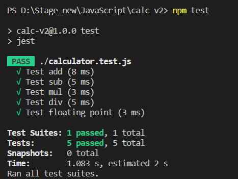
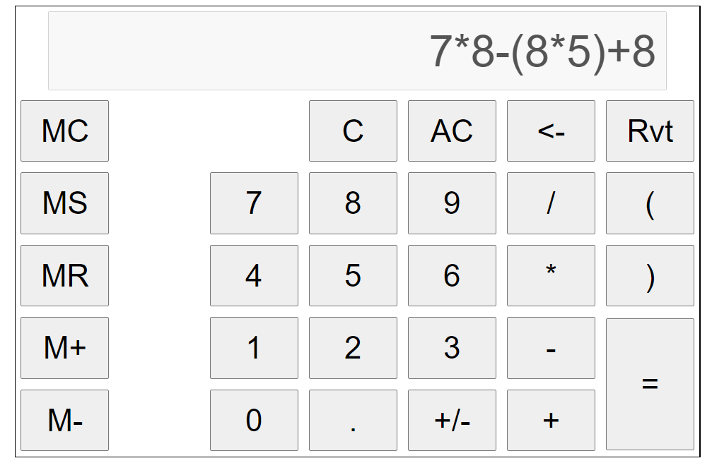

## Тестовое задание JS разработчик. 

### Задача:  
Реализовать калькулятор на странице html;  
Нужно реализовать стандартный калькулятор с использованием чистого JS или TypeScript;  
Схематический вид калькулятора:  
https://www.figma.com/file/Ua1FefM9AUBiSDQOkc0XwoRd/Calculate?node-id=1%3A3  
Ограничения:  
В реализации не допустимо использование js-фреймворков;  
Максимум 12 знаков до запятой;  
Максимум 8 знаков после запятой;  
При деление на 0 выводим на экран: Infinity;  
Display недоступен для ввода значений с клавиатуры, ввод данных с клавиатуры осуществляем через события;  
Для тестирования математики и функциональности используем «jest»(https://jestjs.io/ru/) или можно любой другой test framework;  
Кнопка «Rvt» доступна только после выполнения «=», и возвращает последнее выражение.  

### Реализация
Installation:  
`npm install` 

Running tests:  
`npm test`

  
  
